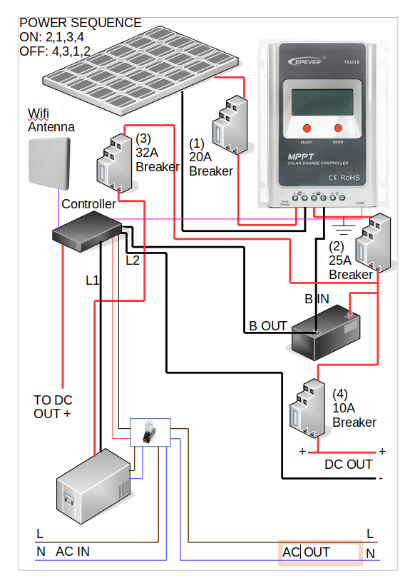
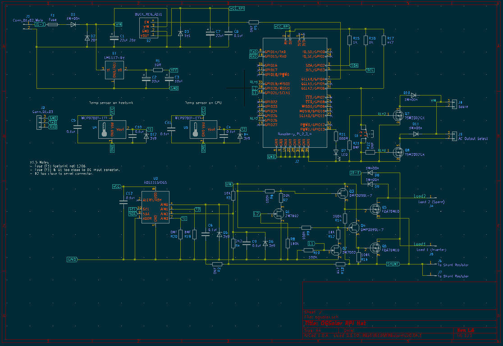
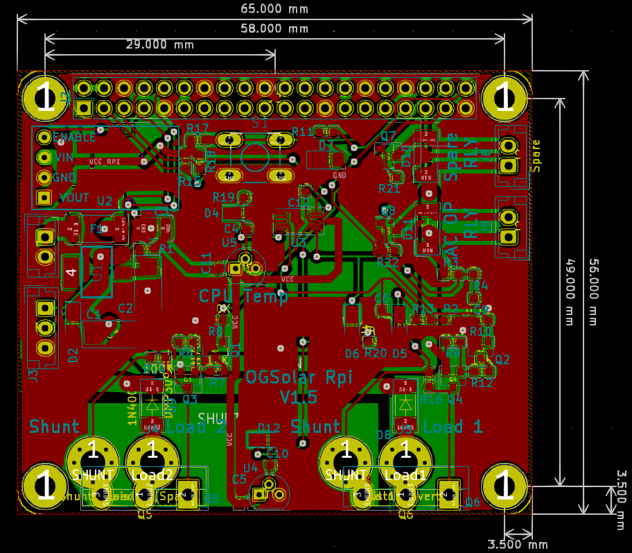
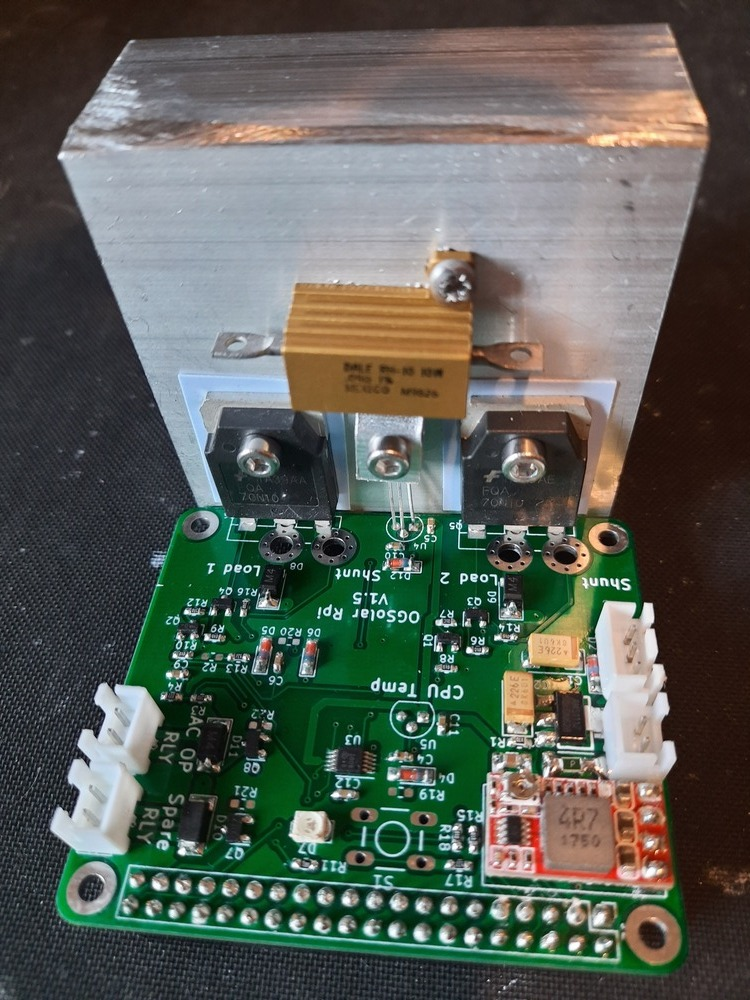
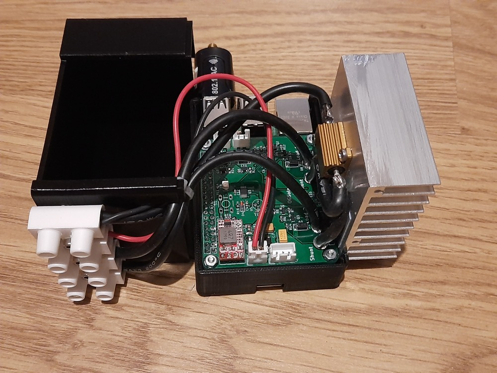
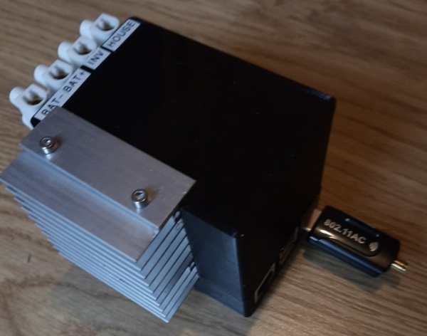
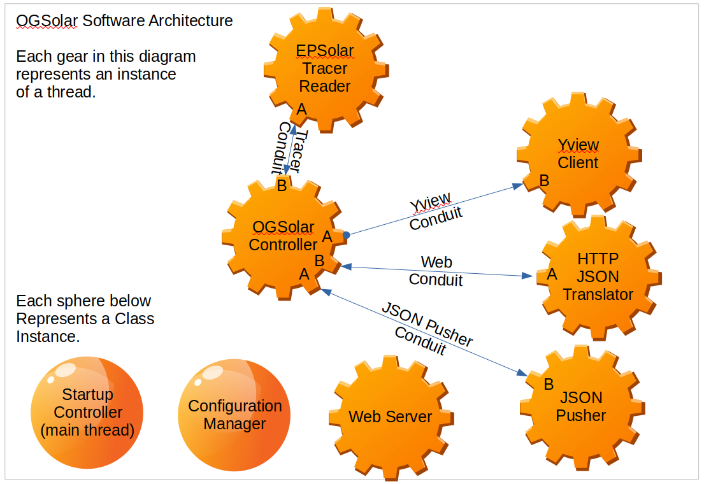
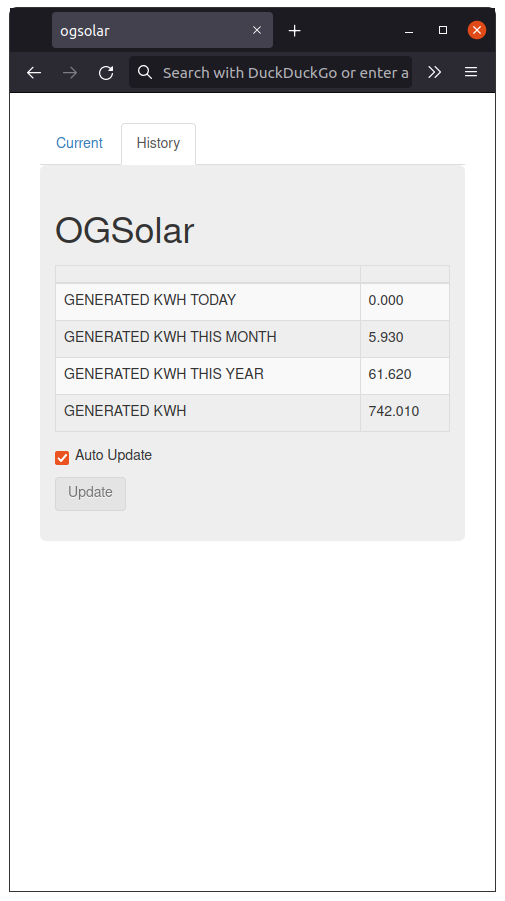

# OGSolar
An off grid Solar monitoring solution. This repo defines all the hardware 
(PCB and case design) and software needed. A diagram of the system is 
shown below.



The system is sited in a shed in my garden with two 200W solar panels 
mounted on the roof of the shed. The Epsolar Tracer 4120 MPPT controller
is connected to a 40AH LION battery.

The AC OUT feed is used to power a pond pump. This is powered from the
battery when sufficient charge is available and from an AC supply when
insufficient charge is available on the battery.

The DC out feed is used to power a charging station (phones/tablets etc)
inside my house. This cuts out when the voltage on the battery drops to a
low level.

The controller is a Raspberry Pi with a PCB (detailed bellow) connected 
that provides the ability to control power, measure voltage, current 
and temperatures and also extends a WiFi network into the (metal) shed.

## Controller Hardware Design.

The OGSolar controller consists of a Raspberry Pi with a header PCB.
This header PCB provides the ability to switch two loads using MOSFET
outputs and another two loads using relay outputs. It also provides the 
ability to monitor the voltage and current drawn along with the 
temperature of the Raspberry Pi processor and the heat sink 
temperature.







The LED on the PCB will light when the unit is connected to the WiFi network.





This project is an update of a previous off grid solar project that has been running for over 7 years. Details of this project can be found [here](https://projects.pausten.me.uk/ogsolar_project.html)


## Software Design.
The software architecture chosen uses a micro services pattern. I used this project
as a testing ground for a micro services architecture. I found that 

- The initial implementation cost was a bit higher than other approaches mostly due to the
requirement to manage data flow between the entities in the system.
- Fixing bugs/issues was easier as it was generally easier to determine the root cause of
performance issues due to the nature of distributed system responsibilities. 



The above architecture uses a Tornado web server. This presents a local web interface (shown below). 
The web interface uses bootstrap to allow the layout to resize itself. 
I used [bootstrap studio](https://bootstrapstudio.io/) to design the web interface as this 
reduced the effort required to design a maintain a web interface. 
The ogsolar/www folder contains a bootstrap studio project file for the design.




The software running on the Raspberry Pi also connects to the [Yview Framework](https://github.com/pjaos/yview)
which allows integration with servers running database systems and webservers. 
The OGSolar device works without connecting to the YView network but the YView
network provides access to a wider network of devices using technologies such 
as MQTT servers. An example of the OGsolar unit providing data to such a
system can be found [here](https://projects.pausten.me.uk/ogsolar_history.html).
This shows live data from a running OGSolar unit.


### Embedded Device Software
The OGSolar device is command line driven. When the ogsolar package is installed two programs are available 'ogsolar' and 'tracer'. ogsolar is the application that runs the system operation and tracer is a command line tool that allows direct connection to the EPSolar Tracer 4210 MPPT solar charger. 

#### OGSolar
The ogsolar application can be executed from the Linux command line and has help text as shown below.

```
ogsolar -h
Usage: An application to control an off grid solar installation. Specifically for use with an EPSolar Tracer MPPT controller connected to a battery (Lithium or Lead Acid). An inverter can be used to power devices when sufficient charge is available on the battery.

Options:
  -h, --help            show this help message and exit
  --config              Set the configuration parameters.
  --cal                 Calibrate the voltage and current measurements.
  --quiet               Do not display messages on stdout.
  --inv_on              On startup set the inverter on and select the inverter
                        output. By default the inverter is off and mains AC is
                        selected.
  --web_root=WEB_ROOT   The web root dir (default=/tmp/ogsolar_webroot).
  --max_mem_inc=MAX_MEM_INC
                        The maximum memory (RAM) increase of ogsolar
                        controller software before rebooting the system
                        (default = 10000 kB).
  --sim_json=SIM_JSON   Developer use only. Simulate tracer MPPT Ctrl
                        hardware. A JSON file is needed as the argument. This
                        is a file saved using menu option 2 when running the
                        tracer command. This saves a JSON file with the state
                        of all the tracer unit registers.
  --tracer_log=TRACER_LOG
                        Log file for EPSolar Tracer register values (default =
                        none). If --sim_tracer is used then tracer register
                        values are read from this file. If --sim_tracer is not
                        used then register values read from the Tracer
                        hardware are written (appended) to this file.
  --sim_ads1115         Developer use only. Simulate the ADS1115 ADC on I2c
                        bus hardware.
  --off                 Switch off inverter and spare relay.
  --debug               Enable debugging.
  --no_reboot           In the event of an error a reboot will occur to try
                        and recover. If this option is used this does not
                        occur.
  --enable_auto_start   Auto start when this computer starts.
  --user=USER           The user name when the --enable_auto_start argument is
                        used (default=auser)
  --disable_auto_start  Disable auto starting when this computer starts.
  --check_auto_start    Check the status of an auto started ogsolar instance.
  --dv                  Debug the voltage reading. Read and display the
                        voltage every second.
  --dc                  Debug the current reading. Read and display the
                        current (Amps) every second.
  --dht                 Debug the heatsink temperature reading. Read and
                        display the temperature every second.
  --dpt                 Debug the processor temperature reading. Read and
                        display the temperature every second.
  --tgpio               Toggle the GPIO lines for debugging purposes.
  --rsw                 Read the state of the switch for debugging purposes.
  --l1=L1               Set load 1 on/off (1/0) for debugging purposes. This
                        output should be connected to the inverter.
  --l2=L2               Set load 2 on/off (1/0) for debugging purposes.
  --invr=INVR           Set the inverter relay output on/off (1/0) for
                        debugging purposes.
  --sparer=SPARER       Set the spare relay output on/off (1/0) for debugging
                        purposes.
```

Once configured as detailed [here](docs/commissioning_the_raspberry_pi.md) the solar command can be executed from the command line (without arguments) and will produce output similar to that detailed below.

```
auser@raspberrypi:/tmp $ ogsolar
INFO:  Loaded config from /home/auser/.ogsolar.cfg
INFO:  STARTUP: ogsolar
INFO:  Starting web server.INFO:  Listening on UDP port 2934
INFO:  Turn spare relay OFF
INFO:  select AC source from Mains AC
INFO:  Set inverter output OFF.
INFO:  Set inverter output OFF.
INFO:  Loaded config from /home/auser/.ogsolar_adc_cal.cfg
INFO:  Set inverter off initial state.
INFO:  Set inverter output OFF.
INFO:  Turned load 1 OFF
INFO:  select AC source from Mains AC
INFO:  ------------------> Selected AC from mains supply.
INFO:  Set inverter output ON.
INFO:  Turned load 2 ON
INFO:  Heat sink: 22.3 °C
INFO:  CPU:       40.3 °C
INFO:  Load AMPS: 0.286, Load WATTS 4.263
INFO:  Battery charge state = Not Charging
INFO:  Load 1 OFF:  Battery volts: 14.600. Waiting for battery voltage to reach 15.950 volts.
INFO:  Load 2 ON:  Battery volts: 14.600. Waiting for battery voltage to drop to 14.400 volts.
INFO:  STARTUP: 9 threads running
INFO:  9 threads running (min=8).
INFO:  Memory in use = 18772 kB, increase since startup = 0 kB (max = 10000 kB).
INFO:  Seconds since last AYT reception: 5
INFO:  ipAddress=192.168.1.93
INFO:  Listening on UDP port 2934
INFO:  Turned LED ON
INFO:  9 threads running (min=8).
INFO:  Memory in use = 18772 kB, increase since startup = 0 kB (max = 10000 kB).
INFO:  Heat sink: 22.3 °C
INFO:  CPU:       40.2 °C
INFO:  Load AMPS: 0.262, Load WATTS 3.906
INFO:  Battery charge state = Not Charging
INFO:  Load 1 OFF:  Battery volts: 14.590. Waiting for battery voltage to reach 15.950 volts.
INFO:  Load 2 ON:  Battery volts: 14.590. Waiting for battery voltage to drop to 14.400 volts.
INFO:  9 threads running (min=8).
INFO:  Memory in use = 18936 kB, increase since startup = 164 kB (max = 10000 kB).
INFO:  ipAddress=192.168.1.93
INFO:  Heat sink: 22.3 °C
INFO:  CPU:       40.1 °C
INFO:  Load AMPS: 0.273, Load WATTS 4.067
INFO:  Battery charge state = Not Charging
INFO:  Load 1 OFF:  Battery volts: 14.590. Waiting for battery voltage to reach 15.950 volts.
INFO:  Load 2 ON:  Battery volts: 14.590. Waiting for battery voltage to drop to 14.400 volts.
INFO:  9 threads running (min=8).
INFO:  Memory in use = 18936 kB, increase since startup = 164 kB (max = 10000 kB).
INFO:  ipAddress=192.168.1.93
INFO:  9 threads running (min=8).
INFO:  Memory in use = 18936 kB, increase since startup = 164 kB (max = 10000 kB).
INFO:  Heat sink: 22.3 °C
INFO:  CPU:       40.1 °C
INFO:  Load AMPS: 0.268, Load WATTS 3.994
INFO:  Battery charge state = Not Charging
INFO:  Load 1 OFF:  Battery volts: 14.600. Waiting for battery voltage to reach 15.950 volts.
INFO:  Load 2 ON:  Battery volts: 14.600. Waiting for battery voltage to drop to 14.400 volts.
INFO:  9 threads running (min=8).
INFO:  Memory in use = 18936 kB, increase since startup = 164 kB (max = 10000 kB).
```

The application will monitor the battery voltage and turn on load 1 & 2 if above a minimum voltages. Separate on/off voltage levels can be configured for Load 1 and Load 2. Other information is also reported (E.G heatsink, CPU temperature and Tracer MPPT unit register values). The OGsolar device can be configured to generate syslog data which can be sent to an external syslog server (it is not recommended that the local RPi syslog server is ued to to excessive SD card writes). An example of this data from the syslog server is shown below.

```
pja@lmserver:~$ sudo tail -f /var/log/syslog | grep 192.168.1.98
Oct 19 05:00:27 192.168.1.98 14399 root: STARTUP: ogsolar
Oct 19 05:00:30 192.168.1.98 14439 auser: STARTUP: ogsolar
Oct 19 05:00:30 192.168.1.98 14439 auser: Listening on UDP port 2934
Oct 19 05:00:30 192.168.1.98 14439 auser: Starting web server.
Oct 19 05:00:30 192.168.1.98 14439 auser: Turn spare relay OFF
Oct 19 05:00:30 192.168.1.98 14439 auser: select AC source from Mains AC
Oct 19 05:00:30 192.168.1.98 14439 auser: Set inverter output OFF.
Oct 19 05:00:30 192.168.1.98 14439 auser: Set inverter output OFF.
Oct 19 05:00:30 192.168.1.98 14439 auser: CODES_PER_AMP = 1221
Oct 19 05:00:30 192.168.1.98 14439 auser: CODES_PER_VOLT = 1270
Oct 19 05:00:30 192.168.1.98 14439 auser: NO_CURRENT_CODES = 64
Oct 19 05:00:30 192.168.1.98 14439 auser: Loaded config from /home/auser/.ogsolar_adc_cal.cfg
Oct 19 05:00:30 192.168.1.98 14439 auser: Set inverter off initial state.
Oct 19 05:00:30 192.168.1.98 14439 auser: Set inverter output OFF.
Oct 19 05:00:30 192.168.1.98 14439 auser: Turned load 1 OFF
Oct 19 05:00:32 192.168.1.98 14439 auser: select AC source from Mains AC
Oct 19 05:00:32 192.168.1.98 14439 auser: ------------------> Selected AC from mains supply.
Oct 19 05:00:32 192.168.1.98 14439 auser: Set inverter output ON.
Oct 19 05:00:32 192.168.1.98 14439 auser: Turned load 2 ON
Oct 19 05:00:32 192.168.1.98 14439 auser: EPSolarTracerInterface:_processCmd: 1
Oct 19 05:00:33 192.168.1.98 14439 auser: >>>>>>>>>>>>>>>>>>>>>>>>>>>>> Min battery charge temp (C): 0.0
Oct 19 05:00:33 192.168.1.98 14439 auser: BATTERY CHARGE STATUS=Not Charging
Oct 19 05:00:33 192.168.1.98 14439 auser: PV VOLTS=0
Oct 19 05:00:33 192.168.1.98 14439 auser: PV AMPS=0
Oct 19 05:00:33 192.168.1.98 14439 auser: BATTERY VOLTS=14.59
Oct 19 05:00:33 192.168.1.98 14439 auser: BATTERY AMPS IN=0
Oct 19 05:00:33 192.168.1.98 14439 auser: PV WATTS=0
Oct 19 05:00:33 192.168.1.98 14439 auser: BATTERY WATTS IN=0
Oct 19 05:00:33 192.168.1.98 14439 auser: BATTERY TEMPERATURE (C)=14.59
Oct 19 05:00:33 192.168.1.98 14439 auser: CONTROLLER TEMPERATURE (C)=17.8
Oct 19 05:00:33 192.168.1.98 14439 auser: MPPT_LOAD_VOLTS=0
Oct 19 05:00:33 192.168.1.98 14439 auser: MPPT_LOAD_AMPS=0
Oct 19 05:00:33 192.168.1.98 14439 auser: MPPT_LOAD_WATTS=0
Oct 19 05:00:33 192.168.1.98 14439 auser: GENERATED KW=744.1
Oct 19 05:00:33 192.168.1.98 14439 auser: GENERATED KW TODAY=0
Oct 19 05:00:33 192.168.1.98 14439 auser: GENERATED KW THIS MONTH=8.02
Oct 19 05:00:33 192.168.1.98 14439 auser: GENERATED KW THIS YEAR=63.71
Oct 19 05:00:33 192.168.1.98 14439 auser: Heat sink: 22.3 C
Oct 19 05:00:33 192.168.1.98 14439 auser: CPU:       40.1 C
Oct 19 05:00:33 192.168.1.98 14439 auser: AMPS = 0.283
Oct 19 05:00:33 192.168.1.98 14439 auser: Load AMPS: 0.283, Load WATTS 4.225
Oct 19 05:00:33 192.168.1.98 14439 auser: Battery charge state = Not Charging
Oct 19 05:00:33 192.168.1.98 14439 auser: Load 1 OFF:  Battery volts: 14.590. Waiting for battery voltage to reach 15.950 volts.
Oct 19 05:00:33 192.168.1.98 14439 auser: Load 2 ON:  Battery volts: 14.590. Waiting for battery voltage to drop to 14.400 volts.
Oct 19 05:00:35 192.168.1.98 14439 auser: STARTUP: 9 threads running
Oct 19 05:00:35 192.168.1.98 14439 auser: 9 threads running (min=8).
Oct 19 05:00:35 192.168.1.98 14439 auser: Memory in use = 18496 kB, increase since startup = 0 kB (max = 10000 kB).
Oct 19 05:00:40 192.168.1.98 14439 auser: 9 threads running (min=8).
Oct 19 05:00:40 192.168.1.98 14439 auser: Memory in use = 18892 kB, increase since startup = 396 kB (max = 10000 kB).
Oct 19 05:00:40 192.168.1.98 14439 auser: EPSolarTracerInterface:_processCmd: 1
Oct 19 05:00:41 192.168.1.98 14439 auser: >>>>>>>>>>>>>>>>>>>>>>>>>>>>> Min battery charge temp (C): 0.0
Oct 19 05:00:41 192.168.1.98 14439 auser: BATTERY CHARGE STATUS=Not Charging
Oct 19 05:00:41 192.168.1.98 14439 auser: PV VOLTS=0.02
Oct 19 05:00:41 192.168.1.98 14439 auser: PV AMPS=0
Oct 19 05:00:41 192.168.1.98 14439 auser: BATTERY VOLTS=14.59
Oct 19 05:00:41 192.168.1.98 14439 auser: BATTERY AMPS IN=0
Oct 19 05:00:41 192.168.1.98 14439 auser: PV WATTS=0
Oct 19 05:00:41 192.168.1.98 14439 auser: BATTERY WATTS IN=0
Oct 19 05:00:41 192.168.1.98 14439 auser: BATTERY TEMPERATURE (C)=14.58
Oct 19 05:00:41 192.168.1.98 14439 auser: CONTROLLER TEMPERATURE (C)=17.8
Oct 19 05:00:41 192.168.1.98 14439 auser: MPPT_LOAD_VOLTS=0
Oct 19 05:00:41 192.168.1.98 14439 auser: MPPT_LOAD_AMPS=0
Oct 19 05:00:41 192.168.1.98 14439 auser: MPPT_LOAD_WATTS=0
Oct 19 05:00:41 192.168.1.98 14439 auser: GENERATED KW=744.1
Oct 19 05:00:41 192.168.1.98 14439 auser: GENERATED KW TODAY=0
Oct 19 05:00:41 192.168.1.98 14439 auser: GENERATED KW THIS MONTH=8.02
Oct 19 05:00:41 192.168.1.98 14439 auser: GENERATED KW THIS YEAR=63.71
Oct 19 05:00:41 192.168.1.98 14439 auser: Heat sink: 22.3 C
Oct 19 05:00:41 192.168.1.98 14439 auser: CPU:       40.0 C
Oct 19 05:00:41 192.168.1.98 14439 auser: AMPS = 0.274
Oct 19 05:00:41 192.168.1.98 14439 auser: Load AMPS: 0.274, Load WATTS 4.090
Oct 19 05:00:41 192.168.1.98 14439 auser: Battery charge state = Not Charging
Oct 19 05:00:41 192.168.1.98 14439 auser: Load 1 OFF:  Battery volts: 14.590. Waiting for battery voltage to reach 15.950 volts.
Oct 19 05:00:41 192.168.1.98 14439 auser: Load 2 ON:  Battery volts: 14.590. Waiting for battery voltage to drop to 14.400 volts.
Oct 19 05:00:42 192.168.1.98 14439 auser: Seconds since last AYT reception: 5
Oct 19 05:00:42 192.168.1.98 14439 auser: Listening on UDP port 2934
Oct 19 05:00:45 192.168.1.98 14439 auser: 9 threads running (min=8).
Oct 19 05:00:45 192.168.1.98 14439 auser: Memory in use = 18904 kB, increase since startup = 408 kB (max = 10000 kB).
Oct 19 05:00:46 192.168.1.98 14439 auser: ipAddress=192.168.1.98
Oct 19 05:00:46 192.168.1.98 14439 auser: Turned LED ON
```

#### Tracer
The tracer application can be executed from the Linux command line and has help text as shown below.

```
auser@raspberrypi:/tmp $ tracer -h
usage: tracer.py [-h] [-d] [-p PORT]

Responsible for access to read and write EPSolar Tracer registers.
via the modbus interface over the RS485 serial interface.
The Raspberry PI must have a USB RS485 adaptor connected to a USB port.

optional arguments:
  -h, --help            show this help message and exit
  -d, --debug           Enable debugging.
  -p PORT, --port PORT  The USB port (default=/dev/ttyUSB0).
```

When executed from the command line the tracer command shows a menu of options as shown below. The example below shows a read of all the Tracer devices registers over the modbus interface. The interface to the EPSolar tracer unit was written as part of the OGSolar application.

```
auser@raspberrypi:/tmp $ tracer
INFO:   1: Read all registers
INFO:   2: Save registers to JSON file.
INFO:   3: Load registers from a JSON file.
INFO:   4: Save registers to JSON file.
INFO:   5: Register read.
INFO:   6: Register write.
INFO:   7: Quit
INPUT: Select a menu option: 1
INFO:  Read all registers
INFO:  Took 0.6 seconds to read all registers.
INFO:  ----------------------------------------------------------
self._address          = 0x0002/2
self._regName          = Manual control the load
self._descriptionLines = ('When the load is manual mode，1-manual on 0 -manual off',)
self._unit             = UNDEFINED
self._multiplier       = 1
self._access           = C_R/W
self._rawRegValue      = 0
self._value            = 0
self._lswRegName       = None
INFO:  ----------------------------------------------------------
self._address          = 0x0005/5
self._regName          = Enable load test mode
self._descriptionLines = ('1 Enable', '0 Disable(normal)')
self._unit             = UNDEFINED
self._multiplier       = 1
self._access           = C_R/W
self._rawRegValue      = 0
self._value            = 0
self._lswRegName       = None
INFO:  ----------------------------------------------------------
self._address          = 0x0006/6
self._regName          = Force the load on/off
self._descriptionLines = ('1 Turn on', '0 Turn off (used for temporary test of the load)')
self._unit             = UNDEFINED
self._multiplier       = 1
self._access           = C_R/W
self._rawRegValue      = 0
self._value            = 0
self._lswRegName       = None
INFO:  ----------------------------------------------------------
self._address          = 0x2000/8192
self._regName          = Over temperature inside the device
self._descriptionLines = ('1 The temperature inside the controller is higher than the over-temperature protection point.', '0 Normal')
self._unit             = UNDEFINED
self._multiplier       = 1
self._access           = D_R
self._rawRegValue      = 0
self._value            = 0
self._lswRegName       = None
INFO:  ----------------------------------------------------------
self._address          = 0x200c/8204
self._regName          = Day/Night
self._descriptionLines = ('1-Night, 0-Day',)
self._unit             = UNDEFINED
self._multiplier       = 1
self._access           = D_R
self._rawRegValue      = 1
self._value            = 1.0
self._lswRegName       = None
INFO:  ----------------------------------------------------------
self._address          = 0x3000/12288
self._regName          = Charging equipment rated input voltage
self._descriptionLines = ('PV array rated voltage',)
self._unit             = V
self._multiplier       = 100
self._access           = R
self._rawRegValue      = 10000
self._value            = 100.0
self._lswRegName       = None
INFO:  ----------------------------------------------------------
self._address          = 0x3001/12289
self._regName          = Charging equipment rated input current
self._descriptionLines = ('PV array rated current',)
self._unit             = A
self._multiplier       = 100
self._access           = R
self._rawRegValue      = 4000
self._value            = 40.0
self._lswRegName       = None
INFO:  ----------------------------------------------------------
self._address          = 0x3002/12290
self._regName          = Charging equipment rated input power L
self._descriptionLines = ('PV array rated power (low 16 bits)',)
self._unit             = W
self._multiplier       = 100
self._access           = R
self._rawRegValue      = 38464
self._value            = 384.64
self._lswRegName       = None
INFO:  ----------------------------------------------------------
self._address          = 0x3003/12291
self._regName          = Charging equipment rated input power H
self._descriptionLines = ('PV array rated power (high 16 bits)',)
self._unit             = W
self._multiplier       = 100
self._access           = R
self._rawRegValue      = 1
self._value            = 1040.0
self._lswRegName       = Charging equipment rated input power L
INFO:  ----------------------------------------------------------
self._address          = 0x3004/12292
self._regName          = Charging equipment rated output voltage
self._descriptionLines = ("Battery's voltage",)
self._unit             = V
self._multiplier       = 100
self._access           = R
self._rawRegValue      = 2400
self._value            = 24.0
self._lswRegName       = None
INFO:  ----------------------------------------------------------
self._address          = 0x3005/12293
self._regName          = Charging equipment rated output current
self._descriptionLines = ('Rated charging current to battery',)
self._unit             = A
self._multiplier       = 100
self._access           = R
self._rawRegValue      = 4000
self._value            = 40.0
self._lswRegName       = None
INFO:  ----------------------------------------------------------
self._address          = 0x3006/12294
self._regName          = Charging equipment rated output power L
self._descriptionLines = ('Rated charging power to battery (low 16 bits)',)
self._unit             = W
self._multiplier       = 100
self._access           = R
self._rawRegValue      = 38464
self._value            = 384.64
self._lswRegName       = None
INFO:  ----------------------------------------------------------
self._address          = 0x3007/12295
self._regName          = Charging equipment rated output power H
self._descriptionLines = ('Rated charging power to battery (high 16 bits)',)
self._unit             = W
self._multiplier       = 100
self._access           = R
self._rawRegValue      = 1
self._value            = 1040.0
self._lswRegName       = Charging equipment rated output power L
INFO:  ----------------------------------------------------------
self._address          = 0x3008/12296
self._regName          = Charging mode
self._descriptionLines = ('0001H-PWM',)
self._unit             = UNDEFINED
self._multiplier       = 1
self._access           = R
self._rawRegValue      = 2
self._value            = 2.0
self._lswRegName       = None
INFO:  ----------------------------------------------------------
self._address          = 0x300e/12302
self._regName          = Rated output current of load
self._descriptionLines = ('',)
self._unit             = A
self._multiplier       = 100
self._access           = R
self._rawRegValue      = 4000
self._value            = 40.0
self._lswRegName       = None
INFO:  ----------------------------------------------------------
self._address          = 0x3100/12544
self._regName          = Charging equipment input voltage
self._descriptionLines = Solar charge controller--PV array voltage
self._unit             = V
self._multiplier       = 100
self._access           = R
self._rawRegValue      = 0
self._value            = 0
self._lswRegName       = None
INFO:  ----------------------------------------------------------
self._address          = 0x3101/12545
self._regName          = Charging equipment input current
self._descriptionLines = Solar charge controller--PV array current
self._unit             = A
self._multiplier       = 100
self._access           = R
self._rawRegValue      = 0
self._value            = 0
self._lswRegName       = None
INFO:  ----------------------------------------------------------
self._address          = 0x3102/12546
self._regName          = Charging equipment input power L
self._descriptionLines = ('Solar charge controller--PV array power (low 16 bits)',)
self._unit             = W
self._multiplier       = 100
self._access           = R
self._rawRegValue      = 0
self._value            = 0
self._lswRegName       = None
INFO:  ----------------------------------------------------------
self._address          = 0x3103/12547
self._regName          = Charging equipment input power H
self._descriptionLines = ('Solar charge controller--PV array power (high 16 bits)',)
self._unit             = W
self._multiplier       = 100
self._access           = R
self._rawRegValue      = 0
self._value            = 0
self._lswRegName       = Charging equipment input power L
INFO:  ----------------------------------------------------------
self._address          = 0x3104/12548
self._regName          = Charging equipment output voltage
self._descriptionLines = ('Battery voltage',)
self._unit             = V
self._multiplier       = 100
self._access           = R
self._rawRegValue      = 1461
self._value            = 14.61
self._lswRegName       = None
INFO:  ----------------------------------------------------------
self._address          = 0x3105/12549
self._regName          = Charging equipment output current
self._descriptionLines = ('Battery charging current',)
self._unit             = A
self._multiplier       = 100
self._access           = R
self._rawRegValue      = 0
self._value            = 0
self._lswRegName       = None
INFO:  ----------------------------------------------------------
self._address          = 0x3106/12550
self._regName          = Charging equipment output power L
self._descriptionLines = Battery charging power (low 16 bits)
self._unit             = W
self._multiplier       = 100
self._access           = R
self._rawRegValue      = 0
self._value            = 0
self._lswRegName       = None
INFO:  ----------------------------------------------------------
self._address          = 0x3107/12551
self._regName          = Charging equipment output power H
self._descriptionLines = ('Battery charging power (high 16 bits)',)
self._unit             = W
self._multiplier       = 100
self._access           = R
self._rawRegValue      = 0
self._value            = 0
self._lswRegName       = Charging equipment output power L
INFO:  ----------------------------------------------------------
self._address          = 0x310c/12556
self._regName          = Discharging equipment output voltage
self._descriptionLines = ('Load voltage',)
self._unit             = V
self._multiplier       = 100
self._access           = R
self._rawRegValue      = 0
self._value            = 0
self._lswRegName       = None
INFO:  ----------------------------------------------------------
self._address          = 0x310d/12557
self._regName          = Discharging equipment output current
self._descriptionLines = ('Load current',)
self._unit             = A
self._multiplier       = 100
self._access           = R
self._rawRegValue      = 0
self._value            = 0
self._lswRegName       = None
INFO:  ----------------------------------------------------------
self._address          = 0x310e/12558
self._regName          = Discharging equipment output power L
self._descriptionLines = ('Load power (low 16 bits)',)
self._unit             = W
self._multiplier       = 100
self._access           = R
self._rawRegValue      = 0
self._value            = 0
self._lswRegName       = None
INFO:  ----------------------------------------------------------
self._address          = 0x310f/12559
self._regName          = Discharging equipment output power H
self._descriptionLines = ('Load power (high 16 bits)',)
self._unit             = W
self._multiplier       = 100
self._access           = R
self._rawRegValue      = 0
self._value            = 0
self._lswRegName       = Discharging equipment output power L
INFO:  ----------------------------------------------------------
self._address          = 0x3110/12560
self._regName          = Battery Temperature
self._descriptionLines = ('Battery Temperature',)
self._unit             = C
self._multiplier       = 100
self._access           = R
self._rawRegValue      = 1456
self._value            = 14.56
self._lswRegName       = None
INFO:  ----------------------------------------------------------
self._address          = 0x3111/12561
self._regName          = Temperature inside equipment
self._descriptionLines = ('Temperature inside case',)
self._unit             = C
self._multiplier       = 100
self._access           = R
self._rawRegValue      = 1780
self._value            = 17.8
self._lswRegName       = None
INFO:  ----------------------------------------------------------
self._address          = 0x3112/12562
self._regName          = Power components temperature
self._descriptionLines = ('Heat sink surface temperature of equipments power components',)
self._unit             = C
self._multiplier       = 100
self._access           = R
self._rawRegValue      = 1780
self._value            = 17.8
self._lswRegName       = None
INFO:  ----------------------------------------------------------
self._address          = 0x311a/12570
self._regName          = Battery SOC
self._descriptionLines = ("The percentage of battery's remaining capacity",)
self._unit             = UNDEFINED
self._multiplier       = 100
self._access           = R
self._rawRegValue      = 63
self._value            = 0.63
self._lswRegName       = None
INFO:  ----------------------------------------------------------
self._address          = 0x311b/12571
self._regName          = Remote battery temperature
self._descriptionLines = ('The battery tempeture measured by remote temperature sensor',)
self._unit             = C
self._multiplier       = 100
self._access           = R
self._rawRegValue      = 1456
self._value            = 14.56
self._lswRegName       = None
INFO:  ----------------------------------------------------------
self._address          = 0x311d/12573
self._regName          = Battery's real rated power
self._descriptionLines = ('Current system rated votlage. 1200, 2400 represent 12V, 24V',)
self._unit             = V
self._multiplier       = 100
self._access           = R
self._rawRegValue      = 1200
self._value            = 12.0
self._lswRegName       = None
INFO:  ----------------------------------------------------------
self._address          = 0x3200/12800
self._regName          = Battery status
self._descriptionLines = ('D3-D0: 01H Overvolt , 00H Normal , 02H Under', 'Volt, 03H Low Volt Disconnect, 04H Fault', 'D7-D4: 00H Normal, 01H Over Temp.(Higher', 'than the warning settings), 02H Low Temp.(', 'Lower than the warning settings),', 'D8: Battery inerternal resistance abnormal 1,', 'normal 0', 'D15: 1-Wrong identification for rated voltage')
self._unit             = UNDEFINED
self._multiplier       = 1
self._access           = R
self._rawRegValue      = 3
self._value            = 3.0
self._lswRegName       = None
INFO:  ----------------------------------------------------------
self._address          = 0x3201/12801
self._regName          = Charging equipment status
self._descriptionLines = ('D15-D14: Input volt status. 00 normal, 01 no', 'power connected, 02H Higher volt input, 03H', 'Input volt error.', 'D13: Charging MOSFET is short.', 'D12: Charging or Anti-reverse MOSFET is short.', 'D11: Anti-reverse MOSFET is short.', 'D10: Input is over current.', 'D9: The load is Over current.', 'D8: The load is short.', 'D7: Load MOSFET is short.', 'D4: PV Input is short.', 'D3-2: Charging status. 00 No charging,01 Float,02', 'Boost,03 Equlization.', 'D1: 0 Normal, 1 Fault.', 'D0: 1 Running, 0 Standby.')
self._unit             = UNDEFINED
self._multiplier       = 1
self._access           = R
self._rawRegValue      = 1
self._value            = 1.0
self._lswRegName       = None
INFO:  ----------------------------------------------------------
self._address          = 0x3300/13056
self._regName          = Maximum input volt (PV) today
self._descriptionLines = ('00: 00 Refresh every day',)
self._unit             = V
self._multiplier       = 100
self._access           = R
self._rawRegValue      = 8
self._value            = 0.08
self._lswRegName       = None
INFO:  ----------------------------------------------------------
self._address          = 0x3301/13057
self._regName          = Minimum input volt (PV) today
self._descriptionLines = ('00: 00 Refresh every day',)
self._unit             = V
self._multiplier       = 100
self._access           = R
self._rawRegValue      = 0
self._value            = 0
self._lswRegName       = None
INFO:  ----------------------------------------------------------
self._address          = 0x3302/13058
self._regName          = Maximum battery volt today
self._descriptionLines = ('00: 00 Refresh every day',)
self._unit             = V
self._multiplier       = 100
self._access           = R
self._rawRegValue      = 1465
self._value            = 14.65
self._lswRegName       = None
INFO:  ----------------------------------------------------------
self._address          = 0x3303/13059
self._regName          = Minimum battery volt today
self._descriptionLines = ('00: 00 Refresh every day',)
self._unit             = V
self._multiplier       = 100
self._access           = R
self._rawRegValue      = 1454
self._value            = 14.54
self._lswRegName       = None
INFO:  ----------------------------------------------------------
self._address          = 0x3304/13060
self._regName          = Consumed energy today L
self._descriptionLines = ('00: 00 Clear every day (low 16 bits ',)
self._unit             = KWH
self._multiplier       = 100
self._access           = R
self._rawRegValue      = 0
self._value            = 0
self._lswRegName       = None
INFO:  ----------------------------------------------------------
self._address          = 0x3305/13061
self._regName          = Consumed energy today H
self._descriptionLines = ('00: 00 Clear every day (high 16 bits)',)
self._unit             = KWH
self._multiplier       = 100
self._access           = R
self._rawRegValue      = 0
self._value            = 0
self._lswRegName       = Consumed energy today L
INFO:  ----------------------------------------------------------
self._address          = 0x3306/13062
self._regName          = Consumed energy this month L
self._descriptionLines = ('00: 00 Clear on the first day of month (low 16 bits)',)
self._unit             = KWH
self._multiplier       = 100
self._access           = R
self._rawRegValue      = 17
self._value            = 0.17
self._lswRegName       = None
INFO:  ----------------------------------------------------------
self._address          = 0x3307/13063
self._regName          = Consumed energy this month H
self._descriptionLines = ('00: 00 Clear on the first day of month (high 16 bits)',)
self._unit             = KWH
self._multiplier       = 100
self._access           = R
self._rawRegValue      = 0
self._value            = 0.17
self._lswRegName       = Consumed energy this month L
INFO:  ----------------------------------------------------------
self._address          = 0x3308/13064
self._regName          = Consumed energy this year L
self._descriptionLines = ('00: 00 Clear on 1, Jan (low 16 bits)',)
self._unit             = KWH
self._multiplier       = 100
self._access           = R
self._rawRegValue      = 116
self._value            = 1.16
self._lswRegName       = None
INFO:  ----------------------------------------------------------
self._address          = 0x3309/13065
self._regName          = Consumed energy this year H
self._descriptionLines = ('00: 00 Clear on 1, Jan (high 16 bits)',)
self._unit             = KWH
self._multiplier       = 100
self._access           = R
self._rawRegValue      = 0
self._value            = 1.16
self._lswRegName       = Consumed energy this year L
INFO:  ----------------------------------------------------------
self._address          = 0x330a/13066
self._regName          = Total consumed energy L
self._descriptionLines = ('(low 16 bits)',)
self._unit             = KWH
self._multiplier       = 100
self._access           = R
self._rawRegValue      = 203
self._value            = 133038.08
self._lswRegName       = Total consumed energy H
INFO:  ----------------------------------------------------------
self._address          = 0x330b/13067
self._regName          = Total consumed energy H
self._descriptionLines = ('(high 16 bits)',)
self._unit             = KWH
self._multiplier       = 100
self._access           = R
self._rawRegValue      = 0
self._value            = 0
self._lswRegName       = None
INFO:  ----------------------------------------------------------
self._address          = 0x330c/13068
self._regName          = Generated energy today L
self._descriptionLines = ('00: 00 Clear every day (low 16 bits)',)
self._unit             = KWH
self._multiplier       = 100
self._access           = R
self._rawRegValue      = 0
self._value            = 0
self._lswRegName       = None
INFO:  ----------------------------------------------------------
self._address          = 0x330d/13069
self._regName          = Generated energy today H
self._descriptionLines = ('(high 16 bits)',)
self._unit             = KWH
self._multiplier       = 100
self._access           = R
self._rawRegValue      = 0
self._value            = 0
self._lswRegName       = Generated energy today L
INFO:  ----------------------------------------------------------
self._address          = 0x330e/13070
self._regName          = Generated energy this month L
self._descriptionLines = ('00: 00 Clear on the first day of month (low 16 bits)',)
self._unit             = KWH
self._multiplier       = 100
self._access           = R
self._rawRegValue      = 802
self._value            = 8.02
self._lswRegName       = None
INFO:  ----------------------------------------------------------
self._address          = 0x330f/13071
self._regName          = Generated energy this month H
self._descriptionLines = ('(high 16 bits)',)
self._unit             = KWH
self._multiplier       = 100
self._access           = R
self._rawRegValue      = 0
self._value            = 8.02
self._lswRegName       = Generated energy this month L
INFO:  ----------------------------------------------------------
self._address          = 0x3310/13072
self._regName          = Generated energy this year L
self._descriptionLines = ('00: 00 Clear on 1, Jan (low 16 bits)',)
self._unit             = KWH
self._multiplier       = 100
self._access           = R
self._rawRegValue      = 6371
self._value            = 63.71
self._lswRegName       = None
INFO:  ----------------------------------------------------------
self._address          = 0x3311/13073
self._regName          = Generated energy this year H
self._descriptionLines = ('(high 16 bits)',)
self._unit             = KWH
self._multiplier       = 100
self._access           = R
self._rawRegValue      = 0
self._value            = 63.71
self._lswRegName       = Generated energy this year L
INFO:  ----------------------------------------------------------
self._address          = 0x3312/13074
self._regName          = Total generated energy L
self._descriptionLines = ('(low 16 bits)',)
self._unit             = KWH
self._multiplier       = 100
self._access           = R
self._rawRegValue      = 8874
self._value            = 88.74
self._lswRegName       = None
INFO:  ----------------------------------------------------------
self._address          = 0x3313/13075
self._regName          = Total generated energy H
self._descriptionLines = ('(high 16 bits)',)
self._unit             = KWH
self._multiplier       = 100
self._access           = R
self._rawRegValue      = 1
self._value            = 744.1
self._lswRegName       = Total generated energy L
INFO:  ----------------------------------------------------------
self._address          = 0x3314/13076
self._regName          = Carbon dioxide reduction L
self._descriptionLines = ('Saving 1 Kilowatt=Reduction 0.997KG (Carbon dioxide) = Reduction 0.272KG (Carton) (low 16 bits)',)
self._unit             = TON
self._multiplier       = 100
self._access           = R
self._rawRegValue      = 74
self._value            = 0.74
self._lswRegName       = None
INFO:  ----------------------------------------------------------
self._address          = 0x3315/13077
self._regName          = Carbon dioxide reduction H
self._descriptionLines = ('(high 16 bits)',)
self._unit             = TON
self._multiplier       = 100
self._access           = R
self._rawRegValue      = 0
self._value            = 0.74
self._lswRegName       = Carbon dioxide reduction L
INFO:  ----------------------------------------------------------
self._address          = 0x331b/13083
self._regName          = Battery Current L
self._descriptionLines = ('The net battery current,charging current minus the discharging one.', 'The positive value represents A charging and negative, discharging (low 16 bits).')
self._unit             = A
self._multiplier       = 100
self._access           = R
self._rawRegValue      = 0
self._value            = 0
self._lswRegName       = None
INFO:  ----------------------------------------------------------
self._address          = 0x331c/13084
self._regName          = Battery Current H
self._descriptionLines = ('(high 16 bits)',)
self._unit             = A
self._multiplier       = 100
self._access           = R
self._rawRegValue      = 0
self._value            = 0
self._lswRegName       = Battery Current L
INFO:  ----------------------------------------------------------
self._address          = 0x331d/13085
self._regName          = Battery Temp
self._descriptionLines = ('Battery Temp.',)
self._unit             = C
self._multiplier       = 100
self._access           = R
self._rawRegValue      = 1456
self._value            = 14.56
self._lswRegName       = None
INFO:  ----------------------------------------------------------
self._address          = 0x331e/13086
self._regName          = Ambient Temp
self._descriptionLines = ('Ambient Temp.',)
self._unit             = C
self._multiplier       = 100
self._access           = R
self._rawRegValue      = 1456
self._value            = 14.56
self._lswRegName       = None
INFO:  ----------------------------------------------------------
self._address          = 0x9000/36864
self._regName          = Battery Type
self._descriptionLines = ('0001H- Sealed', '0002H- GEL', '0003H- Flooded', '0000H- User defined')
self._unit             = UNDEFINED
self._multiplier       = 1
self._access           = R/W
self._rawRegValue      = 0
self._value            = 0
self._lswRegName       = None
INFO:  ----------------------------------------------------------
self._address          = 0x9001/36865
self._regName          = Battery Capacity
self._descriptionLines = ('Rated capacity of the battery. PJA: The pdf does not state the multiplier for this, 1 is a guess.',)
self._unit             = AH
self._multiplier       = 1
self._access           = R/W
self._rawRegValue      = 200
self._value            = 200.0
self._lswRegName       = None
INFO:  ----------------------------------------------------------
self._address          = 0x9002/36866
self._regName          = Temperature compensation coefficient
self._descriptionLines = ('Range 0-9. PJA: -3 is the default value when read from the unit. This does not tie up with the range 0-9 stated in the pdf.',)
self._unit             = MV_C_2V
self._multiplier       = 100
self._access           = R/W
self._rawRegValue      = 300
self._value            = 3.0
self._lswRegName       = None
INFO:  ----------------------------------------------------------
self._address          = 0x9003/36867
self._regName          = High Volt.disconnect
self._descriptionLines = ('',)
self._unit             = V
self._multiplier       = 100
self._access           = R/W
self._rawRegValue      = 1637
self._value            = 16.37
self._lswRegName       = None
INFO:  ----------------------------------------------------------
self._address          = 0x9004/36868
self._regName          = Charging limit voltage
self._descriptionLines = ('',)
self._unit             = V
self._multiplier       = 100
self._access           = R/W
self._rawRegValue      = 1600
self._value            = 16.0
self._lswRegName       = None
INFO:  ----------------------------------------------------------
self._address          = 0x9005/36869
self._regName          = Over voltage reconnect
self._descriptionLines = ('',)
self._unit             = V
self._multiplier       = 100
self._access           = R/W
self._rawRegValue      = 1612
self._value            = 16.12
self._lswRegName       = None
INFO:  ----------------------------------------------------------
self._address          = 0x9006/36870
self._regName          = Equalization voltage
self._descriptionLines = ('',)
self._unit             = V
self._multiplier       = 100
self._access           = R/W
self._rawRegValue      = 1587
self._value            = 15.87
self._lswRegName       = None
INFO:  ----------------------------------------------------------
self._address          = 0x9007/36871
self._regName          = Boost voltage
self._descriptionLines = ('',)
self._unit             = V
self._multiplier       = 100
self._access           = R/W
self._rawRegValue      = 1587
self._value            = 15.87
self._lswRegName       = None
INFO:  ----------------------------------------------------------
self._address          = 0x9008/36872
self._regName          = Float voltage
self._descriptionLines = ('',)
self._unit             = V
self._multiplier       = 100
self._access           = R/W
self._rawRegValue      = 1584
self._value            = 15.84
self._lswRegName       = None
INFO:  ----------------------------------------------------------
self._address          = 0x9009/36873
self._regName          = Boost reconnect voltage
self._descriptionLines = ('',)
self._unit             = V
self._multiplier       = 100
self._access           = R/W
self._rawRegValue      = 1568
self._value            = 15.68
self._lswRegName       = None
INFO:  ----------------------------------------------------------
self._address          = 0x900a/36874
self._regName          = Low voltage reconnect
self._descriptionLines = ('',)
self._unit             = V
self._multiplier       = 100
self._access           = R/W
self._rawRegValue      = 1553
self._value            = 15.53
self._lswRegName       = None
INFO:  ----------------------------------------------------------
self._address          = 0x900b/36875
self._regName          = Under voltage recover
self._descriptionLines = ('',)
self._unit             = V
self._multiplier       = 100
self._access           = R/W
self._rawRegValue      = 1584
self._value            = 15.84
self._lswRegName       = None
INFO:  ----------------------------------------------------------
self._address          = 0x900c/36876
self._regName          = Under voltage warning
self._descriptionLines = ('',)
self._unit             = V
self._multiplier       = 100
self._access           = R/W
self._rawRegValue      = 1553
self._value            = 15.53
self._lswRegName       = None
INFO:  ----------------------------------------------------------
self._address          = 0x900d/36877
self._regName          = Low voltage disconnect
self._descriptionLines = ('',)
self._unit             = V
self._multiplier       = 100
self._access           = R/W
self._rawRegValue      = 1480
self._value            = 14.8
self._lswRegName       = None
INFO:  ----------------------------------------------------------
self._address          = 0x900e/36878
self._regName          = Discharging limit voltage
self._descriptionLines = ('',)
self._unit             = V
self._multiplier       = 100
self._access           = R/W
self._rawRegValue      = 1480
self._value            = 14.8
self._lswRegName       = None
INFO:  ----------------------------------------------------------
self._address          = 0x9013/36883
self._regName          = Real time clock A
self._descriptionLines = ('D7-0 Sec', 'D15-8 Min', '(Year,Month,Day,Min,Sec.should be written simultaneously)')
self._unit             = UNDEFINED
self._multiplier       = 1
self._access           = R/W
self._rawRegValue      = 7692
self._value            = 7692.0
self._lswRegName       = None
INFO:  ----------------------------------------------------------
self._address          = 0x9014/36884
self._regName          = Real time clock B
self._descriptionLines = ('D7-0 Hour', 'D15-8 Day')
self._unit             = UNDEFINED
self._multiplier       = 1
self._access           = R/W
self._rawRegValue      = 5889
self._value            = 5889.0
self._lswRegName       = None
INFO:  ----------------------------------------------------------
self._address          = 0x9015/36885
self._regName          = Real time clock C
self._descriptionLines = ('D7-0 Month', 'D15-8 Year')
self._unit             = UNDEFINED
self._multiplier       = 1
self._access           = R/W
self._rawRegValue      = 4870
self._value            = 4870.0
self._lswRegName       = None
INFO:  ----------------------------------------------------------
self._address          = 0x9016/36886
self._regName          = Equalization charging cycle
self._descriptionLines = ('Interval days of auto equalisation charging in cycle',)
self._unit             = UNDEFINED
self._multiplier       = 1
self._access           = R/W
self._rawRegValue      = 30
self._value            = 30.0
self._lswRegName       = None
INFO:  ----------------------------------------------------------
self._address          = 0x9017/36887
self._regName          = Battery temperature warning upper limit
self._descriptionLines = ('',)
self._unit             = C
self._multiplier       = 100
self._access           = R/W
self._rawRegValue      = 6500
self._value            = 65.0
self._lswRegName       = None
INFO:  ----------------------------------------------------------
self._address          = 0x9018/36888
self._regName          = Battery temperature warning lower limit
self._descriptionLines = ('',)
self._unit             = C
self._multiplier       = 100
self._access           = R/W
self._rawRegValue      = 0
self._value            = 0
self._lswRegName       = None
INFO:  ----------------------------------------------------------
self._address          = 0x9019/36889
self._regName          = Controller inner temperature upper limit
self._descriptionLines = ('',)
self._unit             = C
self._multiplier       = 100
self._access           = R/W
self._rawRegValue      = 8500
self._value            = 85.0
self._lswRegName       = None
INFO:  ----------------------------------------------------------
self._address          = 0x901a/36890
self._regName          = Controller inner temperature upper limit recover
self._descriptionLines = ('After Over Temperature, system recover once it drop to lower than this value',)
self._unit             = C
self._multiplier       = 100
self._access           = R/W
self._rawRegValue      = 7500
self._value            = 75.0
self._lswRegName       = None
INFO:  ----------------------------------------------------------
self._address          = 0x901b/36891
self._regName          = Power component temperature upper limit
self._descriptionLines = ('Warning when surface temperature of power components higher than this value, and charging and discharging stop.',)
self._unit             = C
self._multiplier       = 100
self._access           = R/W
self._rawRegValue      = 8500
self._value            = 85.0
self._lswRegName       = None
INFO:  ----------------------------------------------------------
self._address          = 0x901c/36892
self._regName          = Power component temperature upper limit recover
self._descriptionLines = ('Recover once power components temperature lower than this value',)
self._unit             = C
self._multiplier       = 100
self._access           = R/W
self._rawRegValue      = 7500
self._value            = 75.0
self._lswRegName       = None
INFO:  ----------------------------------------------------------
self._address          = 0x901d/36893
self._regName          = Line Impedance
self._descriptionLines = ('The resistance of the connectted wires.',)
self._unit             = milliohm
self._multiplier       = 100
self._access           = R/W
self._rawRegValue      = 0
self._value            = 0
self._lswRegName       = None
INFO:  ----------------------------------------------------------
self._address          = 0x901e/36894
self._regName          = Night TimeThreshold Volt.(NTTV)
self._descriptionLines = ('PV lower than this value, controller would detect it as sundown',)
self._unit             = V
self._multiplier       = 100
self._access           = R/W
self._rawRegValue      = 500
self._value            = 5.0
self._lswRegName       = None
INFO:  ----------------------------------------------------------
self._address          = 0x901f/36895
self._regName          = Light signal startup (night) delay time
self._descriptionLines = ('PV voltage lower than NTTV, and duration', 'exceeds the Light signal startup (night) delay time', 'controller would detect it as night time.')
self._unit             = Min
self._multiplier       = 1
self._access           = R/W
self._rawRegValue      = 10
self._value            = 10.0
self._lswRegName       = None
INFO:  ----------------------------------------------------------
self._address          = 0x9020/36896
self._regName          = Day Time Threshold Volt.(DTTV)
self._descriptionLines = ('PV voltage higher than this value, controller would detect it as sunrise',)
self._unit             = V
self._multiplier       = 100
self._access           = R/W
self._rawRegValue      = 600
self._value            = 6.0
self._lswRegName       = None
INFO:  ----------------------------------------------------------
self._address          = 0x9021/36897
self._regName          = Light signal turn off(day) delay time
self._descriptionLines = ('PV voltage higher than DTTV, and duration exceeds Light signal turn', 'off(day) delay time delay time, controller would detect it as daytime.')
self._unit             = Min
self._multiplier       = 1
self._access           = R/W
self._rawRegValue      = 10
self._value            = 10.0
self._lswRegName       = None
INFO:  ----------------------------------------------------------
self._address          = 0x903d/36925
self._regName          = Load controlling modes
self._descriptionLines = ('0000H Manual Control', '0001H Light ON/OFF', '0002H Light ON+ Timer/', '0003H Time Control')
self._unit             = UNDEFINED
self._multiplier       = 1
self._access           = R/W
self._rawRegValue      = 0
self._value            = 0
self._lswRegName       = None
INFO:  ----------------------------------------------------------
self._address          = 0x903e/36926
self._regName          = Working time length 1
self._descriptionLines = ('The length of load output timer1, D15-D8,hour, D7-D0, minute',)
self._unit             = UNDEFINED
self._multiplier       = 1
self._access           = R/W
self._rawRegValue      = 256
self._value            = 256.0
self._lswRegName       = None
INFO:  ----------------------------------------------------------
self._address          = 0x903f/36927
self._regName          = Working time length 2
self._descriptionLines = ('The length of load output timer2', 'D15-D8, hour', 'D7-D0, minute')
self._unit             = UNDEFINED
self._multiplier       = 1
self._access           = R/W
self._rawRegValue      = 256
self._value            = 256.0
self._lswRegName       = None
INFO:  ----------------------------------------------------------
self._address          = 0x9042/36930
self._regName          = Turn on timing 1_SEC
self._descriptionLines = ('',)
self._unit             = second
self._multiplier       = 1
self._access           = R/W
self._rawRegValue      = 0
self._value            = 0
self._lswRegName       = None
INFO:  ----------------------------------------------------------
self._address          = 0x9043/36931
self._regName          = Turn on timing 1_MIN
self._descriptionLines = ('',)
self._unit             = Min
self._multiplier       = 1
self._access           = R/W
self._rawRegValue      = 0
self._value            = 0
self._lswRegName       = None
INFO:  ----------------------------------------------------------
self._address          = 0x9044/36932
self._regName          = Turn on timing 1_HOUR
self._descriptionLines = ('',)
self._unit             = hour
self._multiplier       = 1
self._access           = R/W
self._rawRegValue      = 19
self._value            = 19.0
self._lswRegName       = None
INFO:  ----------------------------------------------------------
self._address          = 0x9045/36933
self._regName          = Turn off timing 1_SEC
self._descriptionLines = ('',)
self._unit             = second
self._multiplier       = 1
self._access           = R/W
self._rawRegValue      = 0
self._value            = 0
self._lswRegName       = None
INFO:  ----------------------------------------------------------
self._address          = 0x9046/36934
self._regName          = Turn off timing 1_MIN
self._descriptionLines = ('',)
self._unit             = Min
self._multiplier       = 1
self._access           = R/W
self._rawRegValue      = 0
self._value            = 0
self._lswRegName       = None
INFO:  ----------------------------------------------------------
self._address          = 0x9047/36935
self._regName          = Turn off timing 1_HOUR
self._descriptionLines = ('',)
self._unit             = hour
self._multiplier       = 1
self._access           = R/W
self._rawRegValue      = 6
self._value            = 6.0
self._lswRegName       = None
INFO:  ----------------------------------------------------------
self._address          = 0x9048/36936
self._regName          = Turn on timing 2_SEC
self._descriptionLines = ('',)
self._unit             = second
self._multiplier       = 1
self._access           = R/W
self._rawRegValue      = 0
self._value            = 0
self._lswRegName       = None
INFO:  ----------------------------------------------------------
self._address          = 0x9049/36937
self._regName          = Turn on timing 2_MIN
self._descriptionLines = ('',)
self._unit             = Min
self._multiplier       = 1
self._access           = R/W
self._rawRegValue      = 0
self._value            = 0
self._lswRegName       = None
INFO:  ----------------------------------------------------------
self._address          = 0x904a/36938
self._regName          = Turn on timing 2_HOUR
self._descriptionLines = ('',)
self._unit             = hour
self._multiplier       = 1
self._access           = R/W
self._rawRegValue      = 19
self._value            = 19.0
self._lswRegName       = None
INFO:  ----------------------------------------------------------
self._address          = 0x904b/36939
self._regName          = Turn off timing 2_SEC
self._descriptionLines = ('',)
self._unit             = second
self._multiplier       = 1
self._access           = R/W
self._rawRegValue      = 0
self._value            = 0
self._lswRegName       = None
INFO:  ----------------------------------------------------------
self._address          = 0x904c/36940
self._regName          = Turn off timing 2_MIN
self._descriptionLines = ('',)
self._unit             = Min
self._multiplier       = 1
self._access           = R/W
self._rawRegValue      = 0
self._value            = 0
self._lswRegName       = None
INFO:  ----------------------------------------------------------
self._address          = 0x904d/36941
self._regName          = Turn off timing 2_HOUR
self._descriptionLines = ('',)
self._unit             = hour
self._multiplier       = 1
self._access           = R/W
self._rawRegValue      = 6
self._value            = 6.0
self._lswRegName       = None
INFO:  ----------------------------------------------------------
self._address          = 0x9065/36965
self._regName          = Length of night
self._descriptionLines = ('Set default values of the whole night length of time.', 'D15-D8,hour', 'D7-D0, minute')
self._unit             = UNDEFINED
self._multiplier       = 1
self._access           = R/W
self._rawRegValue      = 3110
self._value            = 3110.0
self._lswRegName       = None
INFO:  ----------------------------------------------------------
self._address          = 0x9067/36967
self._regName          = Battery rated voltage code
self._descriptionLines = ('0, auto recognize. 1-12V, 2-24V',)
self._unit             = UNDEFINED
self._multiplier       = 1
self._access           = R/W
self._rawRegValue      = 1
self._value            = 1.0
self._lswRegName       = None
INFO:  ----------------------------------------------------------
self._address          = 0x9069/36969
self._regName          = Load timing control selection
self._descriptionLines = ('Selected timing period of the load.0, using timer 1, 1-using timer 2.',)
self._unit             = UNDEFINED
self._multiplier       = 1
self._access           = R/W
self._rawRegValue      = 0
self._value            = 0
self._lswRegName       = None
INFO:  ----------------------------------------------------------
self._address          = 0x906a/36970
self._regName          = Default Load On/Off in manual mode
self._descriptionLines = ('0-off, 1-on',)
self._unit             = UNDEFINED
self._multiplier       = 1
self._access           = R/W
self._rawRegValue      = 1
self._value            = 1.0
self._lswRegName       = None
INFO:  ----------------------------------------------------------
self._address          = 0x906b/36971
self._regName          = Equalize duration
self._descriptionLines = ('Usually 60-120 minutes.',)
self._unit             = minute
self._multiplier       = 1
self._access           = R/W
self._rawRegValue      = 120
self._value            = 120.0
self._lswRegName       = None
INFO:  ----------------------------------------------------------
self._address          = 0x906c/36972
self._regName          = Boost duration
self._descriptionLines = ('Usually 60-120 minutes.',)
self._unit             = minute
self._multiplier       = 1
self._access           = R/W
self._rawRegValue      = 120
self._value            = 120.0
self._lswRegName       = None
INFO:  ----------------------------------------------------------
self._address          = 0x906d/36973
self._regName          = Discharging percentage
self._descriptionLines = ("Usually 20%-80%. The percentage of battery's remaining capacity when stop charging",)
self._unit             = %
self._multiplier       = 1
self._access           = R/W
self._rawRegValue      = 80
self._value            = 80.0
self._lswRegName       = None
INFO:  ----------------------------------------------------------
self._address          = 0x906e/36974
self._regName          = Charging percentage
self._descriptionLines = ('Depth of charge, 20%-100%.',)
self._unit             = %
self._multiplier       = 1
self._access           = R/W
self._rawRegValue      = 100
self._value            = 100.0
self._lswRegName       = None
INFO:  ----------------------------------------------------------
self._address          = 0x9070/36976
self._regName          = Management modes of battery charging and discharging
self._descriptionLines = ('Management modes of battery charge and discharge, voltage compensation : 0 and SOC : 1',)
self._unit             = UNDEFINED
self._multiplier       = 1
self._access           = R/W
self._rawRegValue      = 0
self._value            = 0
self._lswRegName       = None
INFO:   1: Read all registers
INFO:   2: Save registers to JSON file.
INFO:   3: Load registers from a JSON file.
INFO:   4: Save registers to JSON file.
INFO:   5: Register read.
INFO:   6: Register write.
INFO:   7: Quit
INPUT: Select a menu option: 
```

