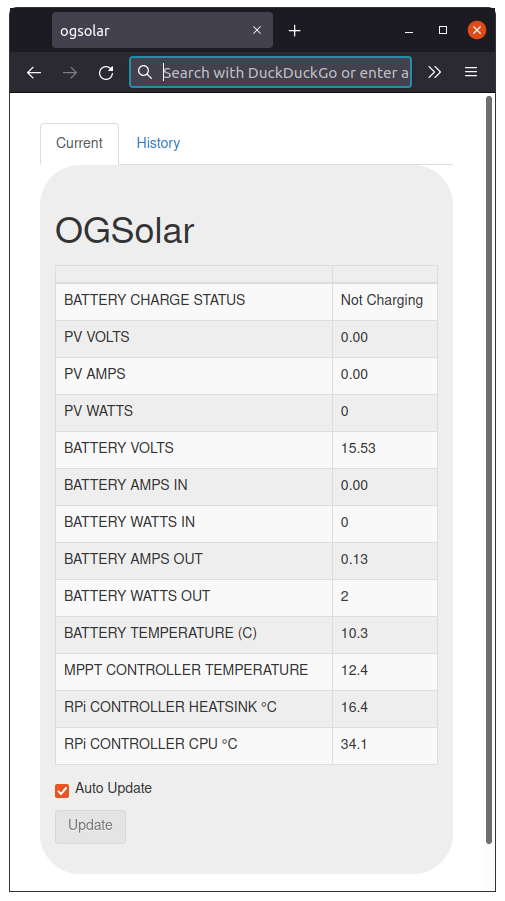

# ogsolar
An off grid Solar monitoring solution. This repo defines all the hardware 
(PCB and case design) and software needed. A diagram of the system is 
shown below.

The system is sited in a shed in my garden with two 200W solar panels 
mounted on the roof of the shed. The Epsolar Tracer 4120 MPPT controller
is connected to a 40AH LION battery.

The AC OUT feed is used to power a pond pump. This is powered from the
battery when sufficient charge is available and from an AC supply when
insufficient charge is available on the battery.

The DC out feed is used to power a charging station (phones/tablets etc)
inside my house. This cuts out when the voltage on the battery drops to a
low level.

The controller is a Raspberry Pi with a PCB (detailed bellow) connected 
that provides the ability to control power and measure voltage, current 
and temperatures and also extends the WiFi network into the (metal) shed.

## Controller Hardware Design.

The OGSolar controller consists of a Raspberry Pi with a header PCB.
This header PCB provides the ability to switch two loads using MOSFET
outputs and another two loads using relay outputs. It also provides the 
ability to monitor the voltage and current drawn along with the 
temperature of the Raspberry Pi processor and the heat sink 
temperature.

## Controller Software Design.
The software architecture chosen uses a micro services pattern. I used this project
as a testing ground for a micro services architecture. I found that 

- The initial implementation cost was a bit higher than other approaches mostly due to the
requirement to manage data flow between the entities in the system.
- Fixing bugs/issues was easier as it was generally easier to determine the root cause of
performance issues due to the nature of distributed system responsibilities. 

The above architecture uses a Tornado web server. This presents a local web interface (shown below).

The software running on the Raspberry Pi also connects to the [Yview Framework](https://github.com/pjaos/yview) and which allows integration with servers running database systems and webservers. An example of the OGsolar unit providing datas to such a system can be found [here](https://projects.pausten.me.uk/ogsolar_history.html). This shows live data from a running OGSolar unit.

